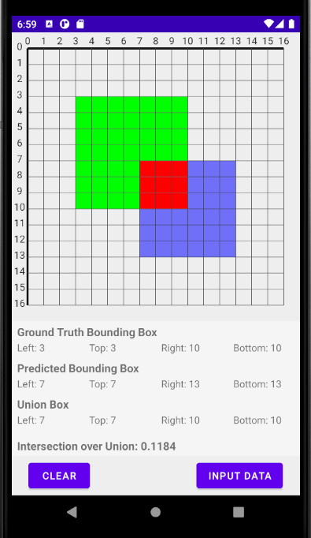

# Intersection over Union (IoU) Sample

The Intersection over Union (IoU or Jaccard index) is a metric for measuring the accuracy of an object detection model. Imagine you have two bounding boxes, one predicted bounding box and one ground truth bounding box, and you want some indication of how good the prediction is. That’s where the Intersection over Union comes into place.

Android application, written in Kotlin, built on Clean Architecture principles. Consists of 4 modules:
- App
- Presentation
- Domain
- Data

App module: Hilt modules, unit tests for repository and validator, assemble all module together.

Presentation module: MVVM architecture with view binding, custom GraphView to show chart on the plot with axes. 
There are 2 screens:
- Graph fragment to show Boxes data and Chart; custom View: Chart with Boxes inside;
- InputData dialog to collect user's coordinate input; with different types of validation: 1st quick immediate validation on presentation layer and 2nd validation on data layer.

Domain module: domain models, repository(ComputationRepository, Validator) interfaces, 2 usecases(GetIntersectionOverUnionUseCase and GetValidationResultUseCase).

Data module: repositories implementation.
    
